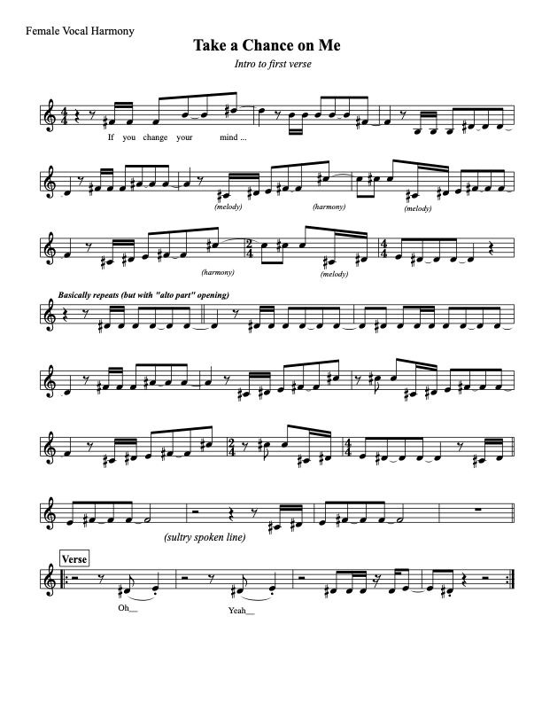

# Rachel Sheets for RevivalFest '23

#### *6/6/23*

## Take a Chance on Me

* **Intro to Verse 1:** 
* 
* **Pre-chorus:** Double the melody on *"It's magic"* and *"But I think you know / That I can't let go"*
* Rest during *"If you change your mind / I'm the first in line"*, then join for rest of chorus as before
* Repeat formula for rest of song, adding those descending *"Take a chance, take a chance, take a chance on me"* 's in the **Outro**

## Chiquitita

* **Verses:** Sing lower line (3rd below melody)
* *TWO OPTIONS for phrase endings, to discuss w/ Jüb:* Either float the melody to you, or have you switch to higher line (illustrated in sheet)
* **Chorus 1:** 
* 

## SOS

* Only sing on **Chorus** -- start on 3rd above melody for *"So when you're near me..."* (pitches: **C, Bb, A**), then double melody for *"When you're gone..."*